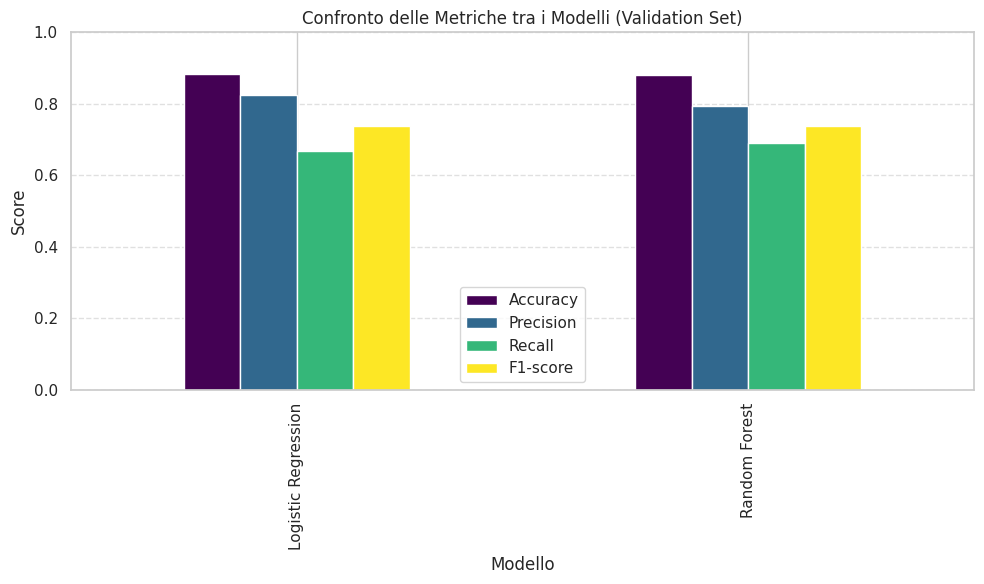
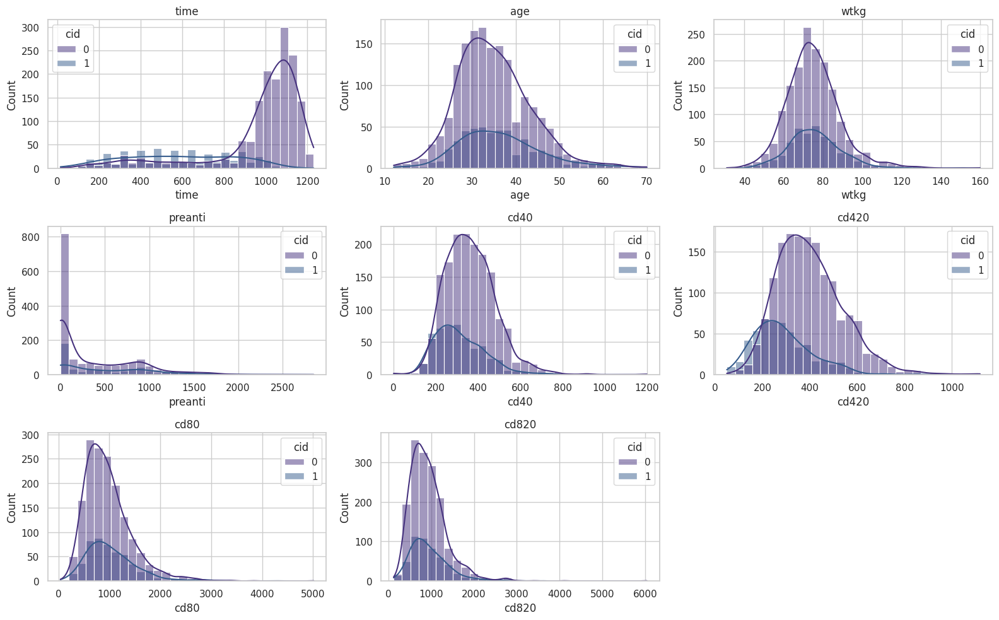
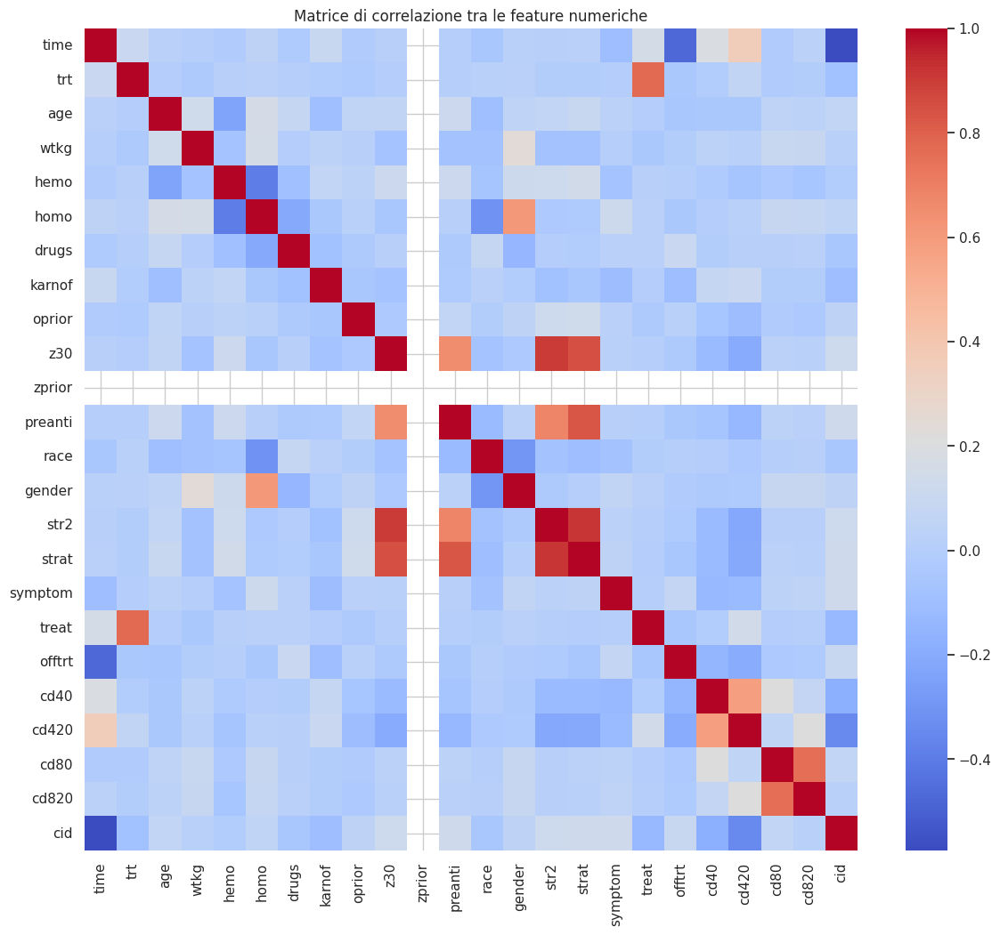
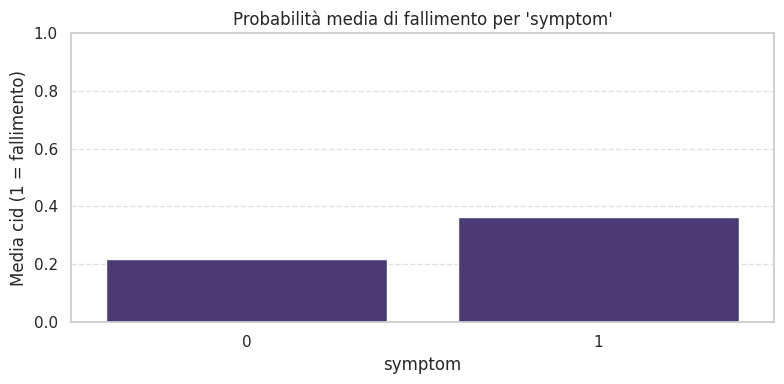
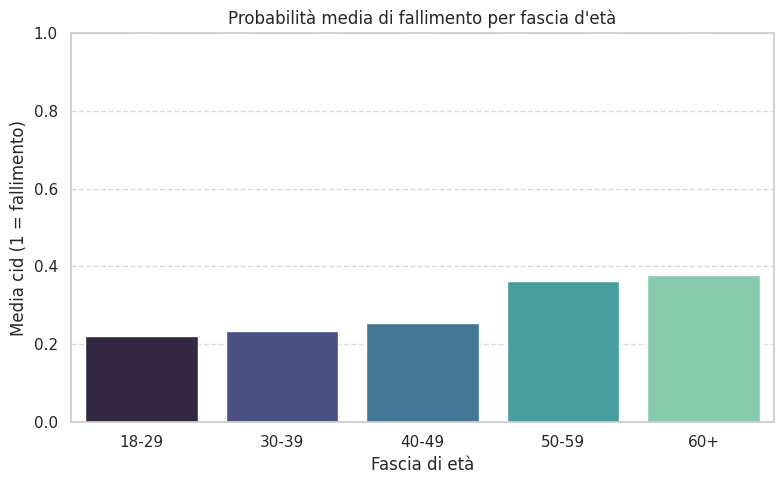
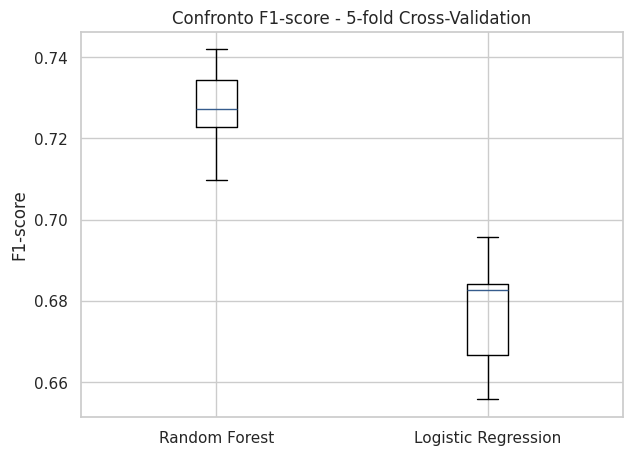
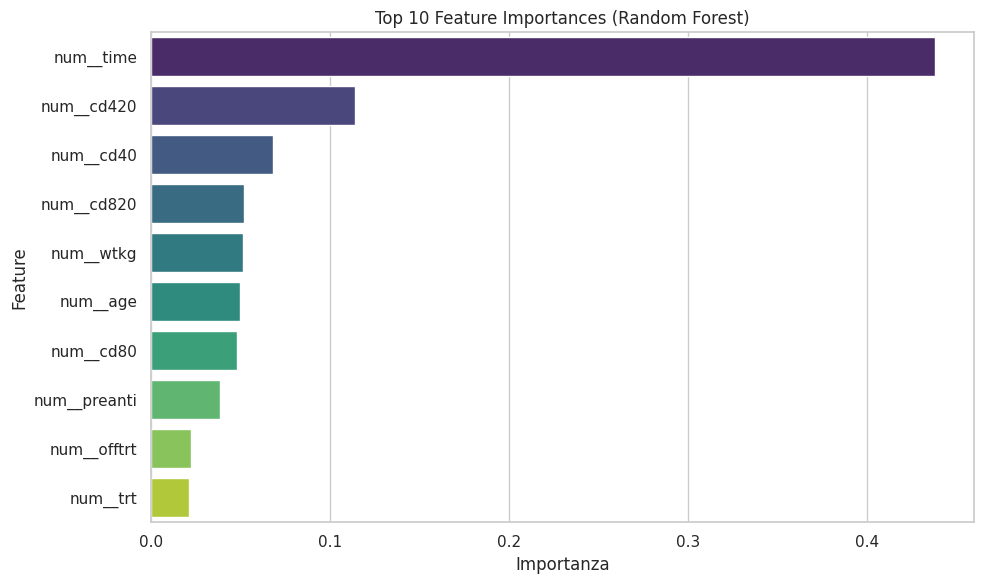
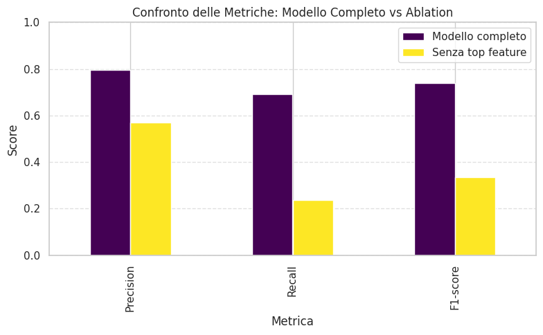
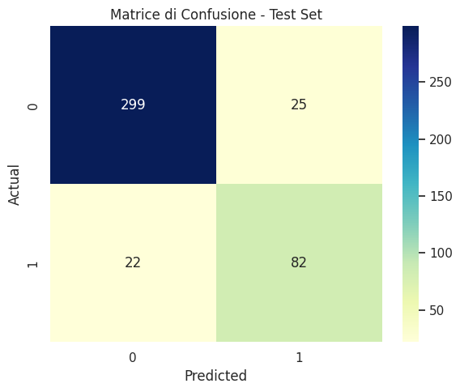

# Clinical Outcome Prediction using the ACTG 175 HIV Clinical Trial Dataset

A complete Machine Learning project based on the **ACTG 175 HIV Clinical Trial** dataset.

The objective is to predict **treatment failure** in HIV-positive patients using demographic, clinical and laboratory variables.

The project covers the entire Machine Learning workflow, from data exploration to model evaluation and interpretation.

---

# Project Overview

This project includes:

- Exploratory Data Analysis (EDA)
- Data preprocessing
- Feature engineering
- Logistic Regression
- Random Forest
- Hyperparameter optimization (Randomized Search CV)
- 5-Fold Cross Validation
- Feature Importance Analysis
- Ablation Study
- Final evaluation on an unseen Test Set

---

# Dataset

The project uses the **ACTG 175 Clinical Trial** dataset, a real clinical dataset published in 1996 containing information from more than **2,000 HIV-positive patients** enrolled in a multicenter clinical trial.

The prediction task is binary:

| Target | Meaning |
|---------|----------|
| **0** | Successful treatment |
| **1** | Treatment failure |

The dataset contains:

- Demographic variables
- Clinical measurements
- Laboratory values (CD4 counts)
- Treatment information
- Previous therapies
- HIV-related clinical indicators

---

# Technologies

- Python
- Pandas
- NumPy
- Matplotlib
- Seaborn
- Scikit-learn

---

# Exploratory Data Analysis

The first phase focused on understanding the dataset through descriptive statistics and graphical exploration.

### Clinical Feature Distributions

This figure shows the distribution of the main numerical clinical variables for the two target classes.

---

### Correlation Matrix

The correlation matrix highlights the relationships among the numerical variables and helps identify redundant information.

---

### Treatment Failure by Symptom

Patients presenting symptoms show a noticeably higher probability of treatment failure.

---

### Treatment Failure by Age Group

Treatment failure becomes progressively more frequent in older age groups.

---

# Machine Learning Models

Two supervised classification algorithms were implemented and compared:

- Logistic Regression
- Random Forest

The Random Forest model was further optimized through **RandomizedSearchCV**.

---

# Validation Performance

The following figure compares the main evaluation metrics obtained on the validation set.

- Accuracy
- Precision
- Recall
- F1-score

The optimized Random Forest achieved the best overall performance.

---

# Cross Validation

A **5-Fold Cross Validation** was performed to verify the robustness and stability of both models.

Random Forest consistently achieved the highest F1-score with lower variability across folds.

---

# Feature Importance

Feature importance analysis shows that **follow-up time** is by far the most influential predictor, followed by CD4 measurements and other clinical variables.

---

# Ablation Study

An ablation study was performed by removing the most important feature identified by the Random Forest.

The resulting performance decreased substantially, demonstrating the critical importance of this feature.

---

# Final Test Evaluation

The optimized Random Forest was finally evaluated on the independent Test Set.

The confusion matrix summarizes the final classification performance.

The model achieved a good balance between Precision and Recall while maintaining strong generalization capability.

---

# Key Results

- Complete end-to-end Machine Learning pipeline
- Real-world clinical dataset
- Extensive Exploratory Data Analysis
- Comparison of multiple classification models
- Hyperparameter optimization
- Robust evaluation using 5-Fold Cross Validation
- Model interpretability through Feature Importance
- Ablation Study to validate feature relevance
- Final evaluation on an unseen Test Set

---

# Author

**Sofia Rubini**
Bachelor's Degree in Philosophy and Artificial Intelligence  
Sapienza University of Rome  

Bachelor's Degree in Philosophy and Artificial Intelligence

Sapienza University of Rome
